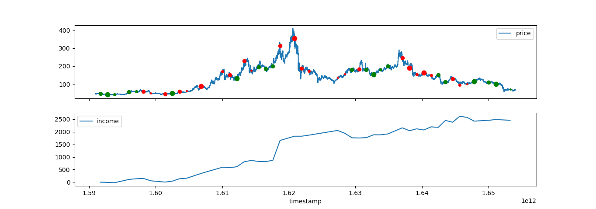

# Engine-RB30

# Description

Engine-RB30 is a framework to backtest and run live your market strategies. Working only on linux.

# Quick start

### Create strategy files

    .
    ├── strategy_name                    
    │   ├── model.py           
    │   ├── executor.py          
    │   └── data_schema.py 
    ├── run.py            
    └── .env

model.py:
~~~
import backtesterRB30 as bt
from random import randint

class Model(bt.Engine):
    
    def __init__(self, config):
        super().__init__(config)
        self.counter = 0
        self._set_buffer_length(200)

    #override
    async def on_feed(self, data: list):
        if self.counter % 30 == 0:
            quant = randint(-2,2)
            if quant != 0:
                message = {
                    'value': quant
                }
                self._trigger_event(message)
        self.counter += 1
~~~

executor.py:
~~~
import backtesterRB30 as bt

class TradeExecutor(bt.Executor):

    def __init__(self, config):
        super().__init__(config)

    #override
    def on_event(self, message):
        self._trade(message['value'])
~~~

data_schema.py:
~~~
import backtesterRB30 as bt
from datetime import datetime

data={
    'log_scale_valuation_chart': True,
    'data':[
        {
            'symbol': '2914jpjpy',
            'historical_data_source': bt.HISTORICAL_SOURCES.ducascopy,
            'main': False,
            'backtest_date_start': datetime(2021,5,1),
            'backtest_date_stop': datetime(2022,8,1),
            'trigger_feed': False,
            'interval': bt.DUKASCOPY_INTERVALS.hour,
        },
        {
            'symbol': 'iefususd',
            'historical_data_source': bt.HISTORICAL_SOURCES.ducascopy,
            'main': True,
            'backtest_date_start': datetime(2021,5,1),
            'backtest_date_stop': datetime(2022,8,1),
            'trigger_feed': True,
            'interval': bt.DUKASCOPY_INTERVALS.hour
        }
    ]
}
DATA = bt.validate_config(data)
~~~

run.py:
~~~
from backtesterRB30 import run_all_microservices
run_all_microservices()
~~~

.env:
~~~
STRATEGY_PATH="strategy_name"
~~~
run it calling:
> sudo python3 run.py

#
# Requirements
For package working you have to have node and npm with npx installed.
~~~
sudo apt  install curl
curl -sL https://deb.nodesource.com/setup_14.x | sudo -E bash -
sudo apt install -y nodejs
sudo apt install -y npm
npm install dukascopy-node --save
~~~

# Debug mode

## Usage of debug mode
Framework gives you access to debug mode that allows you printing summary charts and descriptions every step of your debug. To enable use debug while implementing your strategy follow below steps:
- Use "_debug_breakpoint" method somewhere in your "on_feed" method. This works as breakpoint while debugging. The code will stop in this place.
- Press "ctrl+d" in any moment during backtest loop. This will cause entering debug mode and stopping the code in the nearest moment when your code occurs "_debug_breakpoint" function. You should also se summary and charts printed for current moment of backtest.
- Press "ctrl+n" for next.
- Press "ctrl+q" for quit debug mode.

#TODO gif

## Live code reloads
Debug mode enables user to develop his strategies live with backtest running in debud mode. Thats only possible importable modules to bo live reloaded. To achive this use "_add_reloading_module(path_to_module)" in the init function in your Model class. As an argument to the function pass the path to the module you are goint to be reloaded after every step of your debug.

To preview how it works you can run example strategy in "TODO"

example:

~~~
# TODO
~~~

# Library implementation

If you are implementing piece of code that can be usefull in other strategies, use "libs" folder. It will be avaliable to import in other strategies or notebooks.
Your communication interfaces include in "libs/interfaces" folder.

# Data source implementation
1. In "libs/utils/historical_sources.py 
   1. add your source to HISTORICAL_SOURCES enum
   2. add enum class with your avaliable intervals by analogy to BINANCE_INTERVALS.
   3. add your intervals enum to HISTORICAL_INTERVALS_UNION
2. Add class to "historical_data_feeds/modules" folder.
3. Register your class in historical_data_feeds/historical_data_feeds.py calling "__register_data_source" function.

# Microservice implementation

1. Add your folder with microservice named as your microservice name.
2. Add your microservice to libs/list_of_services enum.
3. Add your microservice in run.sh

Scheme of run file:
~~~
#TODO
~~~

Scheme of service file:
~~~
#TODO
~~~

# Features TODO

1. Live data feeds. Necessery is integration with fix api and real broker.
2. Trades executor with real broker. 
3. Possibility to trade in more than one instrument
4. Add more data sources 